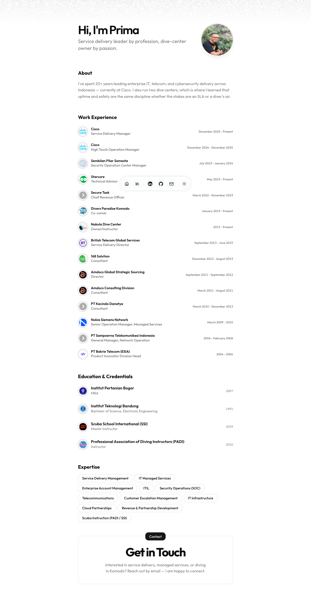

<div align="center">

# primayuda.dev

**Personal website & CV of Aprita Primayuda (Prima)** — service delivery leader by profession, dive-center owner by passion.

[**Live site**](https://primayuda.dev) · [LinkedIn](https://www.linkedin.com/in/aprita-primayuda-b6047b18/) · [GitHub](https://github.com/primayuda)



</div>

## About

I've spent 20+ years leading enterprise IT, telecom, and cybersecurity delivery across Indonesia — currently at Cisco. I also run two dive centers, which is where I learned that uptime and safety are the same discipline whether the stakes are an SLA or a diver's air.

Based in **Bogor, Indonesia**.

## Current roles

| Role | Organization | Since | Notes |
| --- | --- | --- | --- |
| Service Delivery Manager | [Cisco](https://www.cisco.com) | Dec 2025 | Full-time — enterprise service delivery & escalation |
| Technical Advisor | [Starcore](https://starcore.co.id) | May 2023 | Advisory — SaaS & cloud partnerships |
| Co-owner | [Divers Paradise Komodo](https://diversparadisekomodo.com/) | Jan 2019 | SSI dive center, Labuan Bajo |
| Owner / Instructor | [Nakula Dive Center](https://nakuladive.com/) | 2013 | Dive training & pool refresh, Bogor |

## Career highlights

- **Cisco** — Service Delivery Manager and High Touch Operation Manager for enterprise accounts in Indonesia; single point of contact for escalation, project delivery, and customer satisfaction.
- **British Telecom Global Services** — Service Delivery Director for XL Axiata IT infrastructure managed services (~USD 140M/year contract); five years without SLA penalties, 98%+ service desk ratings.
- **Amdocs** — Director of managed services for XL Axiata billing systems serving 50M customers.
- **Secure Task** — Chief Revenue Officer; built distributor partnerships and proof-of-concept engagements in endpoint security.
- **Sembilan Pilar Semesta** — SOC Manager for government and financial services clients.
- **Telecom operators** — Network and product leadership at Sampoerna Telekom (Net1), ESIA, and Nokia Siemens Network.

## Education & credentials

| Credential | Institution |
| --- | --- |
| MBA | [Institut Pertanian Bogor](https://ipb.ac.id) |
| B.Sc. Electronic Engineering | [Institut Teknologi Bandung](https://www.itb.ac.id) |
| SSI Master Instructor | [Scuba Schools International](https://www.divessi.com) |
| PADI Instructor | [PADI](https://www.padi.com) |

## Expertise

Service Delivery Management · IT Managed Services · Enterprise Account Management · ITIL · Security Operations (SOC) · Telecommunications · Customer Escalation Management · IT Infrastructure · Cloud Partnerships · Revenue & Partnership Development · Scuba Instruction (PADI / SSI)

## Blog

Personal writing in Indonesian — diving, travel, and everyday stories:

- [Tersangkut di Bajo](https://primayuda.dev/blog/tersangkut-di-bajo) — from dive instructor to full-time marine tourism in Labuan Bajo
- [Imam dan Khatib Dadakan](https://primayuda.dev/blog/imam-dan-khatib-dadakan) — Idul Fitri prayer at home during the pandemic

## Contact

- Email: [aprita.primayuda@gmail.com](mailto:aprita.primayuda@gmail.com)
- Phone: +62 811-104-584

Interested in service delivery, managed services, or diving in Komodo? Reach out — happy to connect.

---

## Running locally

This site is built with [Astro v6](https://astro.build), React, Tailwind CSS v4, and shadcn/ui, deployed on Cloudflare. Personal data lives in `src/data/resume.tsx`; site settings in `src/data/config.ts`.

**Prerequisites:** Node.js >= 22.12.0, pnpm

```bash
git clone https://github.com/primayuda/primayuda.dev.git
cd primayuda.dev
pnpm install
pnpm dev
```

Open <http://localhost:4321>.

| Command | Action |
| --- | --- |
| `pnpm dev` | Start dev server |
| `pnpm build` | Production build |
| `pnpm preview` | Preview production build |

## Credits

Built on the [Starfolio](https://github.com/webrating/starfolio) Astro portfolio template, inspired by [dillionverma/portfolio](https://github.com/dillionverma/portfolio).
